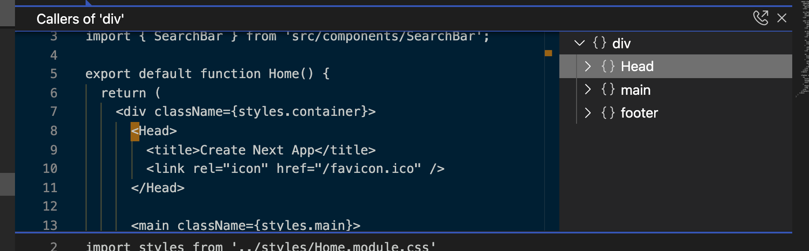

# JSX Quick Keyboard

## Features
Mouselessly move your cursor among JSX tags and get overview of your components

NOTICE: this is just a proof of concept, it will be a long road till it can be used in production. Please remove the extension once you done testing, otherwise it will cause annoying pop-up file whenever you open vscode.

## Usage
A plaintext file will pop up automaticly, you can work right on that.
Press `cmd+shift+a` to display nesting structure of the React component (in plaintext file) and move by arrow keys to go to nodes.

## Release Notes

### 0.0.1
-   Made for early adopter
-   Run with deprecated dependency
-   Have the limitation that this only detect one last root component

### 0.0.2
-   Make it work but still only for plaintext file

### Taking feedback

Please fillout this form if you have any feedback: **coming soon**
Or go to the repository to open an Issue or create PR: [https://github.com/coolcorexix/jsx-viewer-extension](https://github.com/coolcorexix/jsx-viewer-extension)

All the effort is very very appreciated

**Enjoy!**
